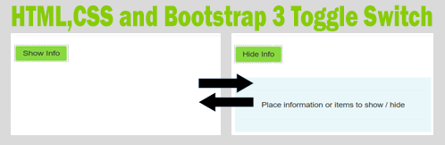

Toggle Button and Bootstrap 3 and CSS
-------------------------------------

**This is code for a toggle button the would show / Hide detail on activating
the button. It incorporates the use of the Bootstrap 3 framework, HTML5 and
CSS.**

View Working Example
--------------------

[View Example](https://www.bayeseanblog.com/blog/public/demo/toggle/toggle.html)

Getting Started
---------------

Download the file folder and extract the files. Run the index.php file in a
XAMPP or WAMP stack. Full Source Code is provided and includes Bootstrap 3
versioned files.

How it Works
------------

A css file is created to perform the heavy work and a html form with a bootstrap
3 button Shows or Hides script within a DIV. Below are sections of the code
which highlight how this all works.

Two files are created index.html and toggle.css.

Extracting some of the CSS code script from toggle.css below ‘.focus’ sets the
background of the area within the div. It allows the area to be hidden or shown.
This is a new class that can be set in the Div.

**.focus {**

**overflow:hidden;**

**background: \#E9F7FA;**

**margin-top :30px;**

**}**

**.focus \> div {**

**-webkit-transition: all 0.2s ease;**

**-moz-transition: margin 0.2s ease;**

**-o-transition: all 0.2s ease;**

**transition: margin 0.2s ease;**

**}**

In order to continue to use the standard bootstrap buttons in other areas of the
website , a dedicated button is created . The basic Hover and Active visual feel
is created to ensure that the button functions close to the bootstrap buttons.

**.btn-extend {**

**background-color: \#88D940;**

**border-color: \#FFFFFF;**

**color: \#121212**

**}**

**/\* Change how it looks when hovered or clicked \*/**

**.btn-extend:hover {**

**background-color: \#AAD83A;**

**border-color: \#E9E7E7;**

**color: \#5D5D5D;**

**}**

**.btn-extend:active {**

**background-color: \#95D14E;**

**border-color: \#FFFFFF;**

**color: \#020202;**

**}**

**This is where the magic is actioned. On key press it will action the ‘show
info’ or ‘hide info’**

**.btn-extend[value="Show Info"] + .focus \> div {**

**margin-top:-100%;**

**}**

**.btn-extend[value="Hide Info"] + .focus {**

**padding:5px;**

**}**

**/\*This hides the transition effects\*/**

**.btn-extend {**

**display:block**

**;margin:5px 0;**

**}**

In the index.html we call the New Button Class created in the CSS:- ‘class="btn
btn-extend" ‘ and in the input we use the CSS created actions:-

‘value="Show Info**" onclick="this.value=this.value=='Show Info'?'Hide
Info':'Show Info';"** ’ see below script.

**\<body\>**

**\
**

**\
**

**\
**

**\<h3\> Bayesean Toggle Button \</h3\>**

**\<h4\> HTML and CSS only \</h4\>**

**\<hr\>**

**\<input class="btn btn-extend" type="button" value="Show Info"
onclick="this.value=this.value=='Show Info'?'Hide Info':'Show Info';"\>**

**//Calling the focus class to call the CSS ‘.focus’ code**

**\
**

**\<hr\>**

**\<div\>**

**\
Place information or items to show / hide\</p\>**

**\<hr\>**

**\</div\>**

**\</div\>**

**\</div\>**

**\</body\>**

### Prerequisites

`This project uses Bootstrap 3. The full download can be obtained from`Bootstrap
3`. The code uses`[PHP 5.6 and higher](http://php.net/downloads.php)`.`

Author
------

**Greg Bayes** - [Bayesean Blog](https://www.bayeseanblog.com/).

https://www.bayeseanblog.com.

License
-------

This project is licensed under the MIT license agreement.

Permission is hereby granted, free of charge, to any person obtaining a copy of
this software and associated documentation files (the "Software"), to deal in
the Software without restriction, including without limitation the rights to
use, copy, modify, merge, publish, distribute, sublicense, and/or sell copies of
the Software, and to permit persons to whom the Software is furnished to do so,
subject to the following conditions: The above copyright notice and this
permission notice shall be included in all copies or substantial portions of the
Software.

THE SOFTWARE IS PROVIDED "AS IS", WITHOUT WARRANTY OF ANY KIND, EXPRESS OR
IMPLIED, INCLUDING BUT NOT LIMITED TO THE WARRANTIES OF MERCHANTABILITY, FITNESS
FOR A PARTICULAR PURPOSE AND NONINFRINGEMENT. IN NO EVENT SHALL THE AUTHORS OR
COPYRIGHT HOLDERS BE LIABLE FOR ANY CLAIM, DAMAGES OR OTHER LIABILITY, WHETHER
IN AN ACTION OF CONTRACT, TORT OR OTHERWISE, ARISING FROM, OUT OF OR IN
CONNECTION WITH THE SOFTWARE OR THE USE OR OTHER DEALINGS IN THE SOFTWARE.
