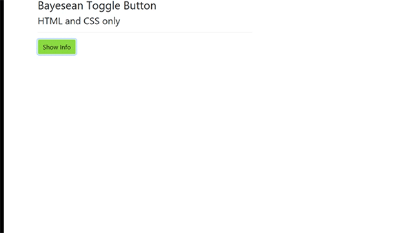

**Toggle Button and Bootstrap 4 CSS and ToggleButton.CSS**

This is an update of the initial blog which now built using bootstrap 4’s
**bootstrapmin.css**. Originally I required a toggle button that would show /
Hide detail on activating a button without the use of using JavaScript code. The
result is a lightweight purely CSS driven project.

Please visit **Bayesean Blog** which explains the usage and code in greater
detail.

<https://bayeseanblog.com/blog/css-to-create-a-functional-toggle-button/1>

**LICENCE MIT**

Happy Coding
